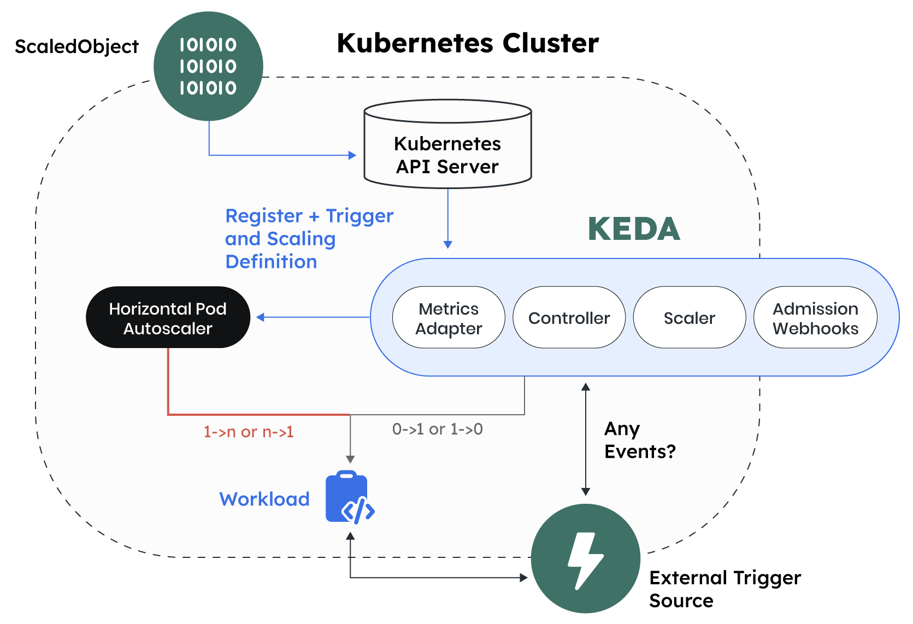

# KEDA R&D
by AMMI & JUPI

## definition du besoin

L'une des promesses du cloud native, c'est de diminuer ses couts de 
compute, via L'autoscaling (VPA & HPA).

Keda devient un incontournable sur le marché, mais peut mis en place
chez nos clients. 

L'objectif de ce projet est, plus que de se faire un avis sur le produit,
d'identifier des metriques et des conditions dans les quels sa mise en place
serait pertinente chez nos client.

## MODUS OPERANDI

### 1. Comprendre KEDA
Kubernetes event driven autoscaler.
HPA scale sur 2 mettriques CPU & RAM, on peut utiliser des metriques custom, via metric server mais c'est galère et 
ça se base quand meme sur des limites statiques.
Scenerio de rush : ça pose porblème, trop imprévisible, pas de possibilité de réagir assez vite
allows for scaling based on a multitude of external triggers, such as messages in a queue, workload in databases, or events in a stream. This
Key components include scalers, metrics adapters, and custom resource definitions such as ScaledObjects and ScaledJobs,
enabling sophisticated, event-driven scaling
- Grosso modo : extension de Kubernetes (controller en +) qui vient se 
mettre sur HPA, ça donne deux trucs en plus 1. scale sur des metriques custom(scaler) 2. Capacité de scalle à 0

