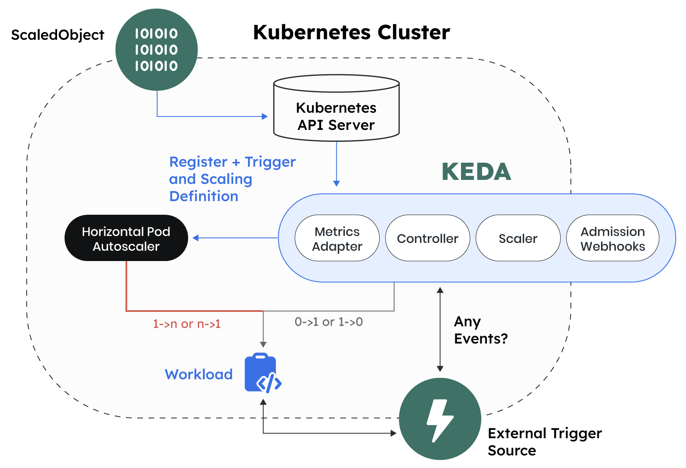

# KEDA R&D
by AMMI & JUPI

## definition du besoin

L'une des promesses du cloud native, c'est de diminuer ses couts de 
compute, via L'autoscaling (VPA & HPA).

Keda devient un incontournable sur le marché, mais peut mis en place
chez nos clients. 

L'objectif de ce projet est, plus que de se faire un avis sur le produit,
d'identifier des metriques et des conditions dans les quels sa mise en place
serait pertinente chez nos client.

## KEDA en quelques mots
Historiquement on a le HPA, qui scale sur des metriques CPU et RAM, mais
trop limité par rapport à des scénarios de rush, ou de workload imprévisible.
De plus, comme ça met a jour la valeur du scale dans le replicaset,
il ne permet pas de scaler à 0.

>ex: Application en assynchrone avec un messaging. => plein de messages, mais l'apllication
traitant les messages 1 par 1, ne consomme pas plus de CPU, qu'il y'ai 1 message dans la
queue, ou 10 000.

On a besoin de scaler sur des metriques custom, des metriques exterieur au cluster 
ou/et de passer le nombre de pod à 0.

pour repondre à ce besoin, KEDA introduit deux nouveaux concepts:
- Triggers basé sur de la data en provenance du metrique server
- Plein de methode d'authentication pour les metriques externes

> souvent, le gros du truc c'est d'avoir les adapteurs pour les metriques externes nativement dans KEDA. 
> Un CRD global au lieu d'un par adapter

## CONECTEURS (AKA SCALERS)
via KEDA introuduit une surcouche qui permet HPA de scaler sur des metriques custom en utilisant son api spé l'api external.metrics.k8s.io.
pas basé sur le metric server, mais sur des connecteurs qui vont chercher les metriques chez différentes sources (scalers).
> sorte d'adapter pour de metriques custom
> 
3 catégories de scaler:
1. **cloud-based** : Azure, AWS, GCP etc, décliné en offre de service
2. **open-source database** : Prometheus, Elasticsearch, Cassandra, Redis, Graphite, InfluxDB, MongoDB, MySQL
3. **vendors** : DataDog, NewRelic

A chacun son Autentification
Spé de son cloud provider (azure identity, aws IAM), basé sur des secrets provisioné dans le kube pour de l'opensource,
ou via des apikeys et autre token pour les vendors.
Les auth pouvent etre globale, par namespace ou resource spé.
> Pour acceder aux metriques Azure App Insights, on peut (doit lol) utiliser des managed identity pour se connecter à
 son log analytics workspace et avoir les bons droits pour pouvoir requeter.

Avantages:
1. zero replica downscaling
2. scale des jobs and scale sur un cron
3. Scaler custom en plus de ceux supporté nativement.

### USE CASES A TESTER

1. Installation manuelle de KEDA ( helm)
2. Opensource scaller (prometheus)
3. Scaller sur autre chose que des messages. (cron?)
4. Scaller des jobs.

### PRESENTATION
-> Green Ops
-> Observability &
